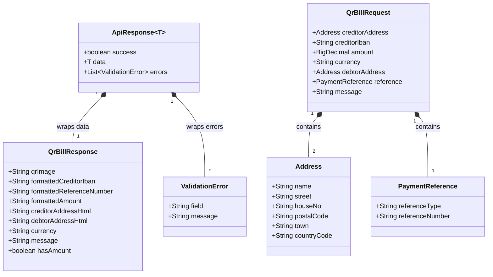

# Entity Relationship & Data Models (ERD)
## Swiss QR-Bill Enterprise System

---

## 1. Class Diagram / Schema Mapping

The following Mermaid diagram outlines the relationships and field types of the models used in the system, separating the request input models from the response envelope and error schemas.

---

## 2. Model Field Descriptions

### 2.1 Address
Represents a structured postal address (Type S) compliant with Swiss billing requirements.
- **name**: Up to 70 characters. Required for creditor; required for debtor if debtor name is present.
- **street**: Up to 70 characters. Required (Type S).
- **houseNo**: Up to 16 characters. Required (Type S).
- **postalCode**: Up to 16 characters. Required.
- **town**: Up to 35 characters. Required.
- **countryCode**: Exactly 2-letter ISO code (e.g., `CH`, `LI`).

### 2.2 PaymentReference
- **referenceType**: Must be one of `QRR` (QR-Reference), `SCOR` (Structured Creditor Reference), or `NON` (No Reference).
- **referenceNumber**: Numeric and modulo-compliant for QRR (27 digits); ISO 11649 alphanumeric for SCOR (5-25 characters); null/empty for NON.

### 2.3 QrBillResponse
The payload returned after a successful generation.
- **qrImage**: The XML/SVG string containing the 46mm x 46mm vector QR code matrix with the centered Swiss Cross.
- **formattedCreditorIban**: The space-separated IBAN for display (e.g. `CH56 0483 5012 3456 7800 9`).
- **formattedReferenceNumber**: The formatted reference number (grouped by 5 digits for QRR, 4 characters for SCOR).
- **formattedAmount**: The Swiss localized amount string (e.g., `1'250.00`) or empty if open amount.
- **creditorAddressHtml**: HTML string format of the creditor address.
- **debtorAddressHtml**: HTML string format of the debtor address (or placeholder if blank).
- **hasAmount**: Flag indicating if an amount was provided.
